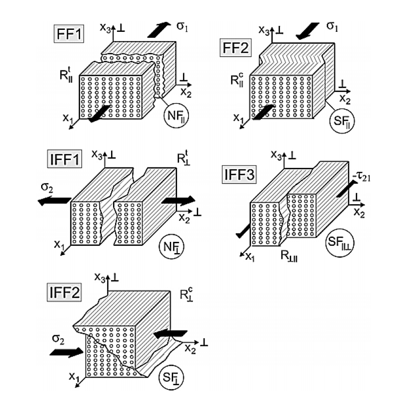
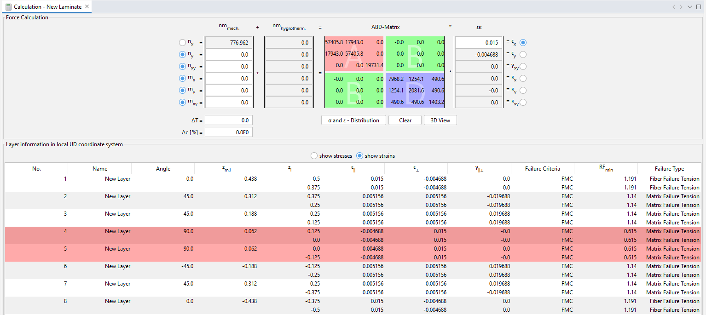
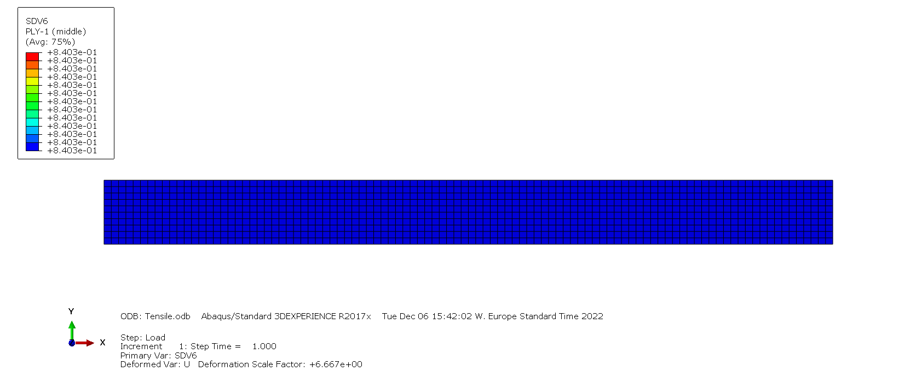
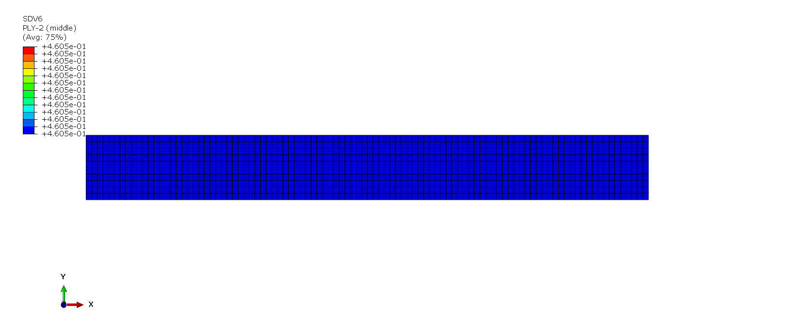
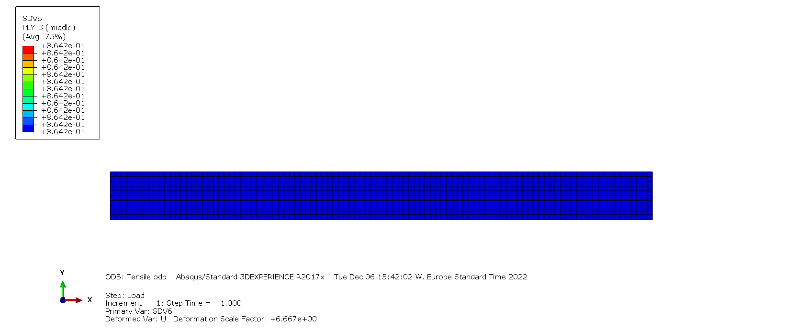

# Cuntze-2D-Subroutine

<em>Failure Modes for Transversely-Isotropic Materials</em>

The following is a UMAT subroutine for Cuntze failure criteria in Abaqus. It applies only to unidirectional composites. The general form of the Cuntze criterion utilizes the entire 3-D state of stress and strain, but this subroutine is used for only 2D elements. The equations for the different failure modes are given below.

### Fiber Failure in Tension (FF1)
The fiber failure in tension is given by 
$$E_{ff}^{\parallel\sigma} = \frac{\epsilon_1^tE_{\parallel}}{R^t_\parallel}$$
It is valid only when $\sigma_{1} \geq 0$. $E_{\parallel}$ is Youngs modulus of the unidirectional lamina in 1 direction and $\epsilon_{1}^t$ is the tensile strain of the lamina in 1 direction.

### Fiber Failure in Compression (FF2)
The fiber failure in tension is given by 
$$E_{ff}^{\parallel\tau} = -\frac{\epsilon_1^cE_{\parallel}}{R^c_\parallel}$$
It is valid only when $\sigma_{1} < 0$. $E_{\parallel}$ is Youngs modulus of the unidirectional lamina in 1 direction and $\epsilon_{1}^c$ is the compressive strain of the lamina in 1 direction.

### Inter Fiber Failure (IFF1)
The inter fiber failure in tension is given by 
$$E_{ff}^{\perp\sigma} = \frac{\sigma_{2}}{R^t_\perp} $$
It is valid only when $\sigma_{2} \geq 0$. $\sigma_{22}$ is the stress of the unidirectional lamina in 22 direction and $Y_T$ is tensile strength in the 22 direction.

### Inter Fiber Failure (IFF2)
The inter fiber failure in compression is given by 
$$E_{ff}^{\perp\tau} = -\frac{\sigma_{2}}{R^c_\perp}$$
It is valid only when $\sigma_{2} < 0$. $\sigma_{22}$ is the stress of the unidirectional lamina in 22 direction and $Y_C$ is compressive strength in the 22 direction.

### Inter Fiber Failure (IFF3)
The inter fiber failure in shear is given by 
$$E_{ff}^{\perp\parallel} = \frac{|\tau_{21}|}{R_{\perp\parallel} - \mu_{\perp\parallel}\sigma_{2}}$$
$\sigma_{2}$ is the stress of the unidirectional lamina in 22 direction, $S$ is the inplane shear strength, $\tau_{12}$ is the inplane shear stress and $\mu_{\perp\parallel}$ is friction parameter.

### Resultant Failure
The resultant failure of all the modes is given by

$$E_{ff}(res) = \Bigl[ E_{ff}(FF1)^m + E_{ff}(FF2)^m + E_{ff}(IFF1)^m + E_{ff}(IFF2)^m + E_{ff}(IFF3)^m \Bigr]^\frac{1}{m}$$

where $m$ is the mode interaction exponent.
# Input to the Model
The following properties need to be entered in the following order.
  * Youngs Modulus in 1 Direction $E_{\parallel}$
  * Youngs Modulus in 2 Direction $E_{\perp}$
  * Poisson's Ratio in 1-2 Plane $\nu_{\perp\parallel}$
  * Inplane Shear Modulus $G_{\perp\parallel}$
  * Longitudinal Strength in 11 Direction $R^t_\parallel$
  * Compressive Strength in 11 Direction $R^c_\parallel$
  * Longitudinal Strength in 22 Direction $R^t_\perp$
  * Compressive Strength in 22 Direction $R^c_\perp$
  * Inplane Shear Strength $R_{\perp\parallel}$
  * Friction Coefficient of the Material $\mu_{\perp\parallel}$
  * Mode Interaction Exponent $m$ 

# Output Visualization
 
There are six solution-dependent state variables. They are as follows
  * SDV1 : Fiber Failure in Tension (FF1)
  * SDV2 : Fiber Failure in Compression (FF2)
  * SDV3 : Inter Fiber Failure (IFF1)
  * SDV4 : Inter Fiber Failure (IFF2)
  * SDV5 : Inter Fiber Failure (IFF3)
  * SDV6 : Resultant Failure of All Modes
  
# Verification

<em>FE Model and Boundary Conditions</em>

A simple tensile test is performed to check the working of the UMAT. The specimen dimensions are 100mm x 10mm. The ply layup is $[0/+45/-45/90]_s$, and each ply is 0.125mm thick. The left end of the specimen is fixed in X, Z, ROTX, ROTY, and ROTZ, and the middle of the left end is fixed in Y. A displacement of 0.15mm is applied on the right end. The material properties are
* $E_{\parallel}$ = 135e3 MPa
* $E_{\perp}$ = 10e3 MPa
* $\nu_{\perp\parallel}$ = 0.25
* $G_{\perp\parallel}$ = 4.3e3 MPa
* $R^t_\parallel$ = 2410 MPa
* $R^c_\parallel$ = 1300 MPa
* $R^t_\perp$ = 86 MPa
* $R^c_\perp$ = 200 MPa
* $R_{\perp\parallel}$ = 152 MPa  

<em>eLamX Results</em>

The same model has been created in eLamX; a composite calculator developed at TU Dresden. Above are the results of the eLamX calculator. From the above image, It can be seen that the failure occurs in the 90° ply. Now we shall be comparing these with the Abaqus UMAT results.

<em>Ply 1</em>

For ply 1, the resultant failure index (SDV6) is 0.8403. The failure index's inverse is the reserve factor; in this case, it is 1.19.

<em>Ply 2</em>

<em>Ply 3</em>

For ply 2 and 3, the resultant failure index (SDV6) is 0.8642, and the reserve factor is 1.15.

<em>Ply 4</em>

For ply 4, the resultant failure index (SDV6) is 1.628. This value is more than one, which means the failure has started as predicted in the eLamX calculator. The reserve factor is 0.6143.
